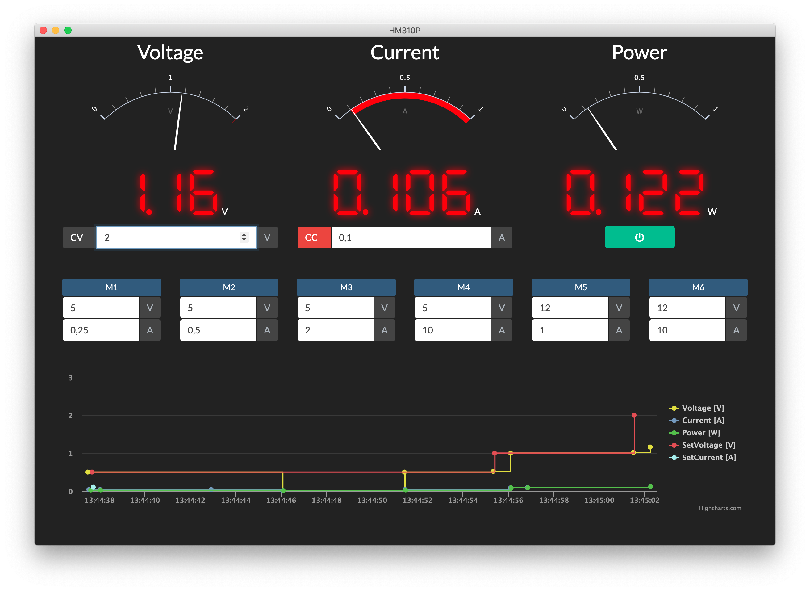

# Hanmatek HM310P

> Electron based application for the Hanmatek HM310P DC Power Supply, offers Charts and CSV Export.

## Usage

[Downloads for macOS, Linux and Windows](https://github.com/hobbyquaker/hanmatek-hm310p/releases/latest)

Lookup the serial port of the HM310P USB interface, on macOS e.g. `/dev/tty.wchusbserial14121130`. Open the application and paste the serial port in _Tools > Settings > Port_.

Linux Users: Don't forget to give your user access to the serial port, on Ubuntu this can be done by adding your user to the dialout group: `sudo usermod -a -G dialout <username>`

## Contributing

Pull requests welcome! Clone the repo, do `npm install` in the project root. Use `npm start` to start the application in debug mode. Build with `npm run dist`.

## Todo/Ideas

* HM305P Support
* Remember window size and gaugeZoom
* Useful os-dependent defaults for serial port settings
* Autocomplete serial port
* Send values to InfluxDB
* REST API to control the device and poll values
* MQTT Interface to control the device and publish values
* Button to reset chart data
* Chart fifo mode with adjustable time range

## Credits

Thanks [@mckenm](https://github.com/mckenm) for documenting the Modbus registers: https://github.com/mckenm/HanmaTekPSUCmd/wiki/Registers

## License

Copyright (c) Sebastian Raff hobbyquaker@gmail.com (https://github.com/hobbyquaker)

Permission is hereby granted, free of charge, to any person obtaining a copy of this software and associated documentation files (the "Software"), to deal in the Software without restriction, including without limitation the rights to use, copy, modify, merge, publish and/or distribute copies of the Software, and to permit persons to whom the Software is furnished to do so, subject to the following conditions:

The above copyright notice and this permission notice shall be included in all copies or substantial portions of the Software.

This software uses [Highcharts](https://www.highcharts.com/blog/products/highcharts/) which is free **only for non-commercial use**.

THE SOFTWARE IS PROVIDED "AS IS", WITHOUT WARRANTY OF ANY KIND, EXPRESS OR IMPLIED, INCLUDING BUT NOT LIMITED TO THE WARRANTIES OF MERCHANTABILITY, FITNESS FOR A PARTICULAR PURPOSE AND NONINFRINGEMENT. IN NO EVENT SHALL THE AUTHORS OR COPYRIGHT HOLDERS BE LIABLE FOR ANY CLAIM, DAMAGES OR OTHER LIABILITY, WHETHER IN AN ACTION OF CONTRACT, TORT OR OTHERWISE, ARISING FROM, OUT OF OR IN CONNECTION WITH THE SOFTWARE OR THE USE OR OTHER DEALINGS IN THE SOFTWARE.
